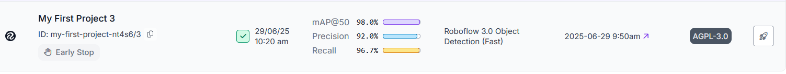

## Info

### Name
<!-- Please enter your name as per submitted resume. -->
Jiya Mary Joseph

### Python Version
<!-- Please specify the Python version you used (e.g., Python 3.8). -->
Python==3.12.4

## Description

### AI
<!-- Provide a brief summary on how the solution was derived using AI Technique -->
""" Approch 1

1. We can use object detection model that provie by model providers(using human language).
   Approch 2:
2. Here I use groq model "meta-llama/llama-4-scout-17b-16e-instruct"

   Approch 3:
3. We can use pretrained model. Here I tried to use YOLO model from the ultralytics. (light weight model).
   Approch 2:
4. We can finetune the model with our custom data on our colab notebook as well as on the platform providing the finetune application Roboflow.steps are

       1.  Create project
       2.  upload the images
       3.  label/annote the images
       
       4.  create dataset version.
           1. splitted the data (train/val/test)
           2. We can do preprocess the data.(we can do size management,convert to bray etc).I skip it.
           3. Done Augmentation process.(Here we can augment the data by flip,convert gray,rotation etc..)

       5. we can export data into the note book as well as can do custom train site
                 
            1. cutom train on Roboflow platform.
                    1. Done the custom train. base model: YOLO v11
                    2. Done early stopping when the validation loss was not improving.
            2. Training on colab note book
                    1. Export data from Roboflow
                    2. Train the data with model : YOLO v8

       7.  Done the Evaluation.
            
            1. map : 98%
            2. precision : 92%
            3. Recall : 96.7%

    

### Non_AI
<!-- Provide a brief summary on how the solution was derived using Non_AI Technique -->
"""Approch:
1. converted the image into gray scale because that is helpful for image processing.
2. Applied Gaussian blur to remove small noise
3. find the threshold by ostu and inversion done such a way that for object given the white(255)and other part as black by considering the threshold value
4. morphological transformation for isolate white pixels.
5. applied distance transformation i.e: here finding distance of each pixel with background.
6. find sure foreground image to get the pixel that is surely on part of object.
7. find the sure background. substract boyh to find unknown region.
8. Done marker labelling. by gving background =1 and unknown=0
9. Applied water shed i.e: consider image as topographical image and gave -1 to boundary.
10. Then count the boundery box.

## Additional Comments
<!-- Optional: Add any additional comments or context about your changes here. -->

  1. It took lot time for labeling process.
  2. I use .env  
      HF_API_TOKEN=""
      GROQ_API_KEY=""
